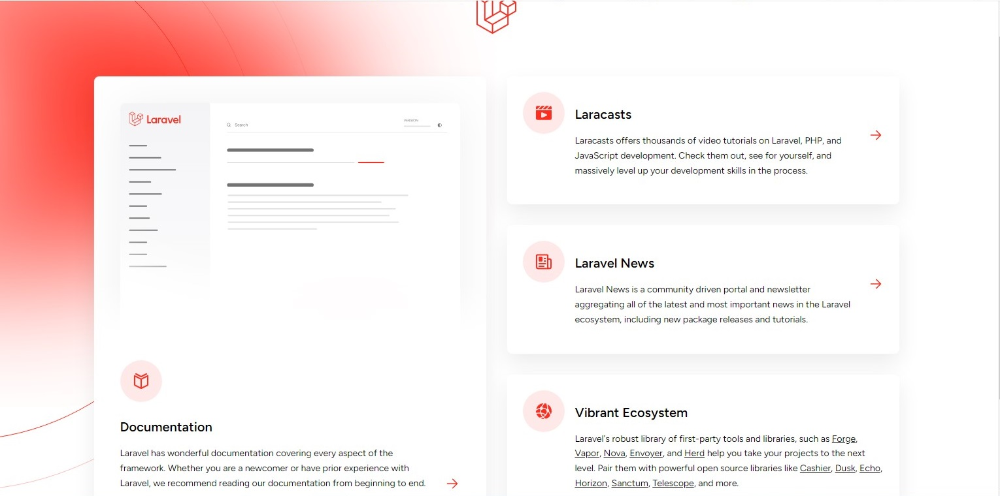

# Продвинутое программирование на PHP — Laravel

## Урок 1. Введение, установка и первичная настройка

### Цели практической работы:
Вы научитесь:

* подготавливать окружение для запуска Laravel;
* устанавливать Laravel.

Полученная картинка по адресу localhost:8080 -

## Урок 2. Контроллеры, экшены и роутинг

### Цели

Вы научитесь:

— устанавливать Laravel;

— создавать контроллер, возвращающий JSON;

— создавать контроллер для обработки формы;

— создавать контроллер, возвращающий шаблон.
